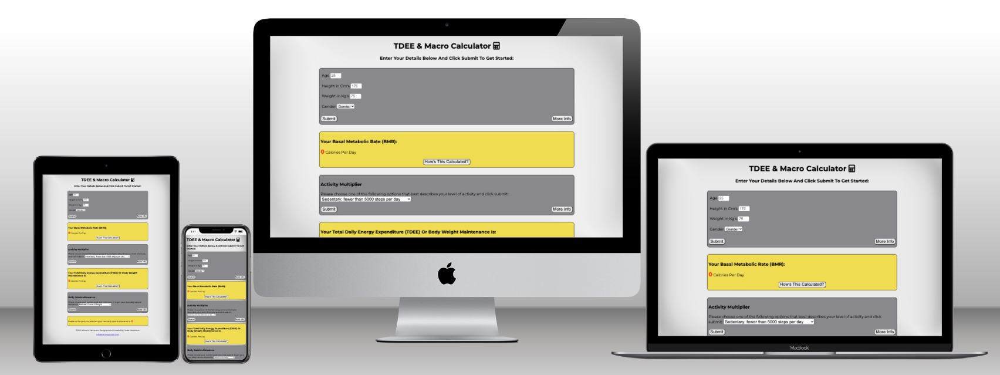

# TDEE & Macro Calculator

The TDEE & Macro Calculator page was created to take the guess work out of calories when it comes to dieting or muscle building. Simply enter some basic information and the page will work out, step by step how many caloires you will need to reach your goal as well as give you an example split to your macros that will fit your new calorie target. You can visit the live site here: [TDEE & Macro Calculator](https://defridge.github.io/Portfolio-2-TDEE-calculator/)

## Features

## Technologies

- HTML
  - The webpage structure was created using HTML as the main language.
- CSS
  - The styling of the website was done using custome CSS saved in an external file.
- JAVASCRIPT
  - JAVASCRIPT was used to the develop the dynamic features of the website, such as calculating BMR and displaying output.
- IDE
  - The website was developed using Codeanywhere IDE.
- Github
  - The source code is hosted on Github and deployed using Git Pages.
- Git
  - Git was used to commit and push code during the project.
- Favicon.io
  - Favicon files were created at [favicon.io](https://favicon.io/favicon-converter/)

## Testing

### Responsiveness

- The website was tested on various screen sizes from Galaxy Fold 280px upwards and is responsive and functions as intended.
- To test this the webpage was loaded in a browser and using Google Dev Tools was changed to 280px and then the responsive window was dragged to max size.
- The webpage responded as intended.
- Some devices the website was tested on outside of Dev Tools were: Iphone 11, Samsung A6, Macbook Air, HP M27fw FHD monitor.

### Accessibility

