# TDEE & Macro Calculator

The TDEE & Macro Calculator page was created to take the guesswork out of calories when it comes to dieting or muscle building. Simply enter some basic information and the page will work out, step by step how many calories you will need to reach your goal as well as give you an example split to your macros that will fit your new calorie target. You can visit the live site here: [TDEE & Macro Calculator](https://defridge.github.io/Portfolio-2-TDEE-calculator/)

## Features

### Site Wide

- The site is made up of a single page broken into different sections.

- Header
  - Simple header design consisting of a site name and some instructions to get started.

- Footer
  - Simple footer design showing name of site author and contact email address.

- Personal Info
  - The first section is where the user will enter some basic info such as age, height, weight, and gender to start the calculations.

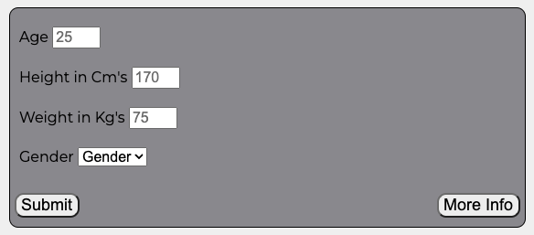

- BMR Section
  - After completing the personal info section the BMR section will display a numerical value for the users basal metabolic rate.

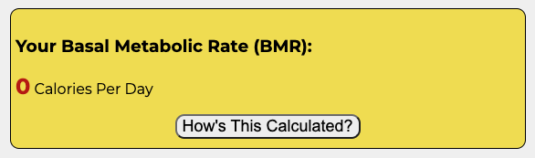

- Activity Multiplier
  - In this section the user is asked to choose one option in a dropdown box that best represents their daily activity.
  - The user has 5 options:
    - Sedentary: fewer than 5000 steps per day
    - Lightly Active: 5000-7500 steps per day
    - Moderately Active: 7500-10000 steps per day
    - Active: 10000-12500 steps per day
    - Highly Active: 12500+ steps per day

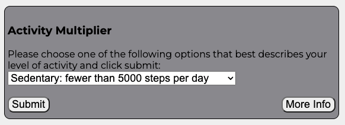

- TDEE
  - Once the user has selected an activity multiplier their TDEE (total daily energy expenditure) will be displayed in this area.
  - The TDEE will be a numerical value showing the amount of calories the user needs to maintain their current weight.

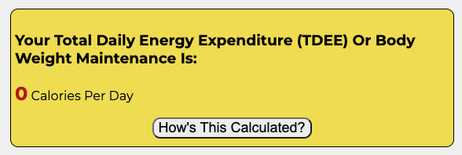

- Goals
  - This is the last section where the user will choose a goal of either weight loss or weight gain and the page will calculate the new caloric amount to match their chosen goals.
  - The user has 5 options:
    - Maintain Current Weight
    - Mild Weight Loss 0.25kg/week
    - Weight Loss 0.5kg/week
    - Mild Weight Gain 0.25kg/week
    - Weight Gain 0.5kg/week

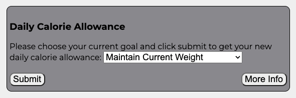

- New Daily Calories
  - After a goal is chosen the new total daily calories will be calculated and display here for the user.
  - A new button will appear on this section which will open a modal box giving the user an example of how to split up their protein, carbs, and fat intake to suit their new calorie goal.

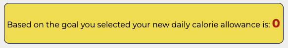

- Submit Buttons
  - There are 3 submit buttons on the page in different sections which when clicked will run the calculations to produce the outputs.

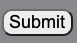

- More Info Buttons
  - There are 3 more info buttons on the page in different sections which when clicked will display a new box containing more information about the section they are located.

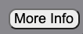

- More info Button example content.
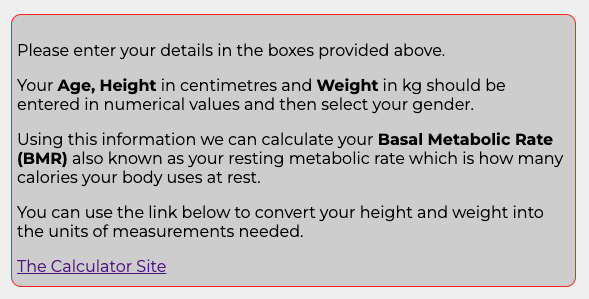

- Hows This Calculated Buttons
  - There are 2 hows this calculated buttons on the page in different sections which when clicked will display a new box containing more information about how the calculations that are running in the background are executed.

- Hows this calculated button example content.
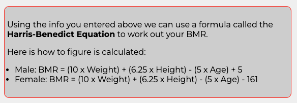

- Modal Box and Button
  - Once the final submit button has been clicked and the final calculation has been run showing the new daily calorie allowance a new clickable button will appear with the wording "click here for example macros".
  - When the user clicks this button a modal box will show on screen with an example breakdown of protein, carbs, and fats ratios that will fit into the new calorie target.
  - These macros are specific to the final calorie amount and the users weight.

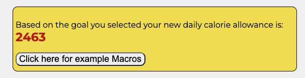

- Modal Box Content Example
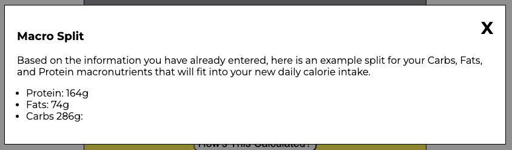

## Technologies

- HTML
  - The webpage structure was created using HTML as the main language.
- CSS
  - The styling of the website was done using custom CSS saved in an external file.
- JAVASCRIPT
  - JAVASCRIPT was used to develop the dynamic features of the website, such as calculating BMR and displaying output.
- IDE
  - The website was developed using Codeanywhere IDE.
- Github
  - The source code is hosted on Github and deployed using Git Pages.
- Git
  - Git was used to commit and push code during the project.
- Favicon.io
  - Favicon files were created at [favicon.io](https://favicon.io/favicon-converter/)

## Testing

### Responsiveness

- The website was tested on various screen sizes from Galaxy Fold 280px upwards and is responsive and functions as intended.
- To test this the webpage was loaded in a browser and using Google Dev Tools was changed to 280px and then the responsive window was dragged to max size.
- The web page responded as intended.
- Some devices the website was tested on outside of Dev Tools were: Iphone 11, Samsung A6, Macbook Air, HP M27fw FHD monitor.

### Accessibility

- [Wave Accessibility](https://wave.webaim.org/) was used to test accessibility on the final deployed website.
- All pages tested and no Errors were found.
- Colour contrasts meet a minimum ratio.
- Heading levels are present and not skipped to ensure the importance of content.
- All labels or aria-labels are in place so that it is read out loud on a screen reader.
- All images have alt labels that will display if the image does not load.

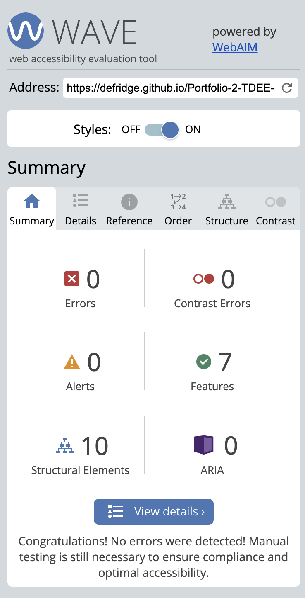

### Lighthouse Testing

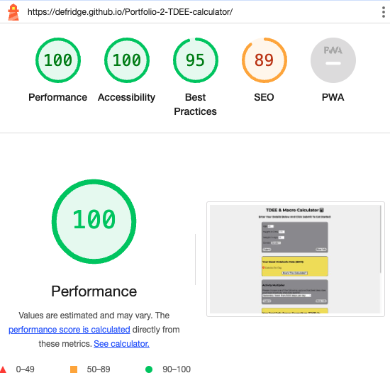

### Functional Testing

- Footer Email link
  - When the user clicks on the email address set in the footer on any device the email application of said device opens in a new email tab.
  - The link works as intended.

- User Input Fields
  - In the first section of the page the user is required to fill in 3 input boxes and choose 1 of 2 options from a drop down menu, they are:
    - Age
    - Height in Cm's
    - Weight in Kg's
    - Gender
- If the user leaves any 1 of these input fields blank or neglects to choose a gender then when they click submit an alert will show in the browser asking them to complete all fields and they will not be able to continue unless done so.

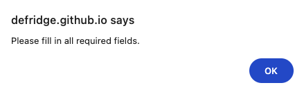

- User Input Field Test 1
  - The first test conducted was to leave all fields blank and to try click submit.
  - Result: Alert showen in browser.
  - Validation worked as intended.

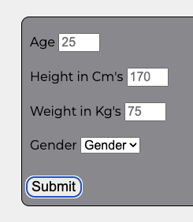

- User Input Field Test 2
  - The second test conducted was to fill in 1 input field, in this case Age and to try click submit.
  - Result: Alert showen in browser.
  - Validation worked as intended.

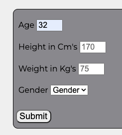

- User Input Field Test 3
  - The third test conducted was to fill in 1 input field, in this case Height and to try click submit.
  - Result: Alert showen in browser.
  - Validation worked as intended.

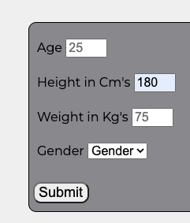

- User Input Field Test 4
  - The fourth test conducted was to fill in 1 input field, in this case Weight and to try click submit.
  - Result: Alert showen in browser.
  - Validation worked as intended.

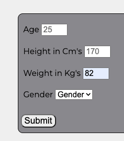

- User Input Field Test 5
  - The fifth test conducted was to click 1 option in gender dropdown and leave all other fields blank, in this case Male and to try click submit.
  - Result: Alert showen in browser.
  - Validation worked as intended.

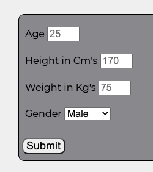

- User Input Field Test 5
  - The sixth test conducted was to fill in a combination of input fields but always leaving 1 blank, in the image below Weight is left blank.
  - This test was run with every combination and the result was always the same.
  - Result: Alert showen in browser.
  - Validation worked as intended.

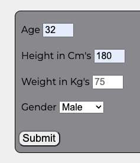

- Submit Button Testing
  - All submit buttons on the website were tested and function as intended.

- More Info Button Testing
  - All more info buttons on the website were tested and function as intended.

- Hows This Calculated Button Testing
  - All hows this calculated buttons on the website were tested and function as intended.

- Javascript Code and Maths Testing Case Study
  - Once confirmed that all buttons and validations were working as intended the calculations run by the javascript code was tested to ensure it was working and to test accuracy of results.
  - For this case study we take a fake user and run through the different stages of the page.
  - Fake user "Bruce Wayne" details:
    - Age 30
    - Height 180cm
    - Weight 80kg
    - Gender Male
    - Lightly Active
    - Wants to lose weight

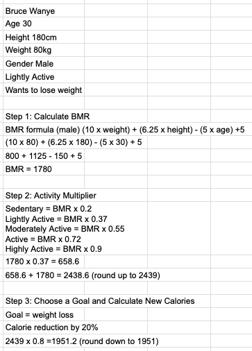

- When compared to calculations done step by step by hand the webpage produces the same results and functions as intended.

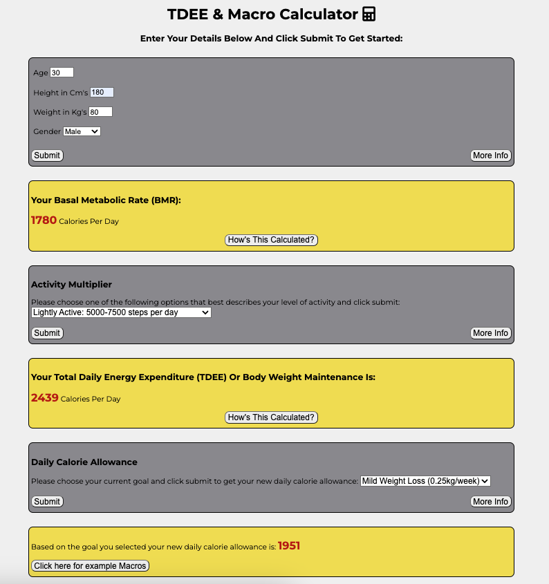

- Macro Example Testing
  - Just like above macro splits were worked out first by hand then compared to the split given by the website.
  - Results are the same and so code functions as intended.

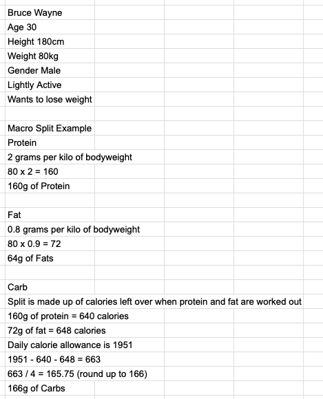

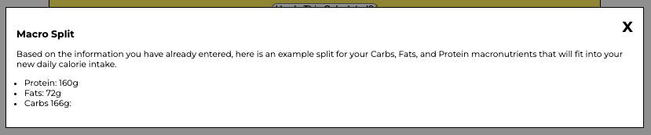

### Validator Testing

- HTML: No errors were returned when passing through the official [W3C Validator](https://validator.w3.org)
  
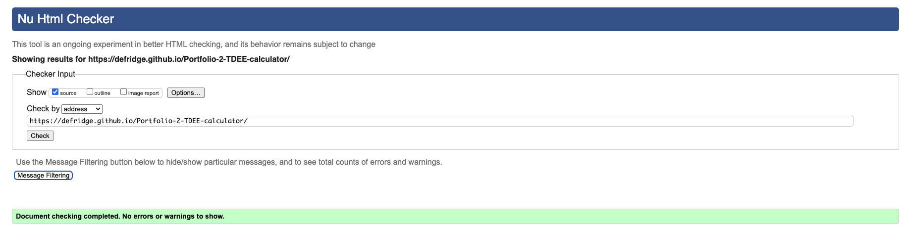

- CSS: No errors were returned when passing through the official [Jigsaw Validator](https://jigsaw.w3.org/css-validator/validator)
  
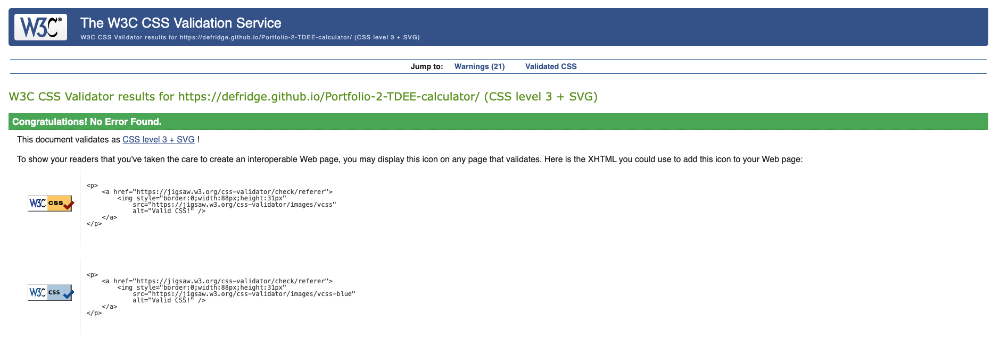

- JavaScript: No errors were returned when passing through the [JShint validator](https://jshint.com/)
  - One warning appears but all code functions as intended.

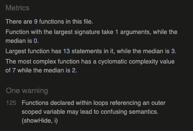

### Bugs

- During some testing it was discovered that the input fields on the page excepted characters such as "e" "-" "+" "up arrow key" "down arrow key".
- Looking into this I found that a floating-point number can consist of these characters so its not a true bug as such but I still wanted to remove this option from the webpage.
- See below an image explaining this in more detail.
- After checking online I was able to find code that will resolve this and have added this to the credits section.

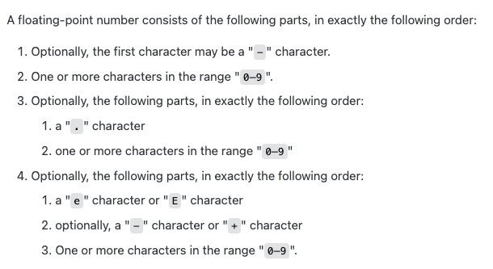

## Deployment

- The site was deployed to GitHub pages.
- In the GitHub repository, navigate to the Settings tab.
- From the source section drop-down menu, select the Master Branch.
- Once the master branch has been selected, the page will be automatically refreshed with a detailed ribbon display to indicate the successful deployment.

## Credits

### Content

- The code to add and style the modal box was taken from [w3schools](https://www.w3schools.com/howto/howto_css_modals.asp).
- The code to remove the option to add special characters to input fields was taken from [stackoverflow](https://stackoverflow.com/questions/31706611/why-does-the-html-input-with-type-number-allow-the-letter-e-to-be-entered-in).
- My Mentor Gareth McGirr for his guidance and support throughout my project.
